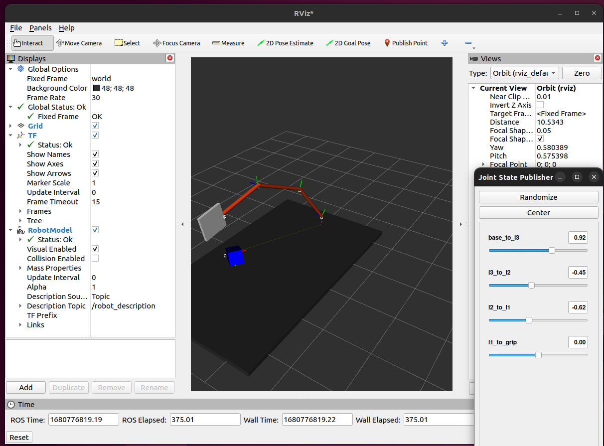

# S-Bot

A ROS2 package. [Github](https://github.com/Oct19/s_bot)

It is recommended that you keep the repo/package name the same, but if you do change it, ensure you do a "Find all" using your IDE (or the built-in GitHub IDE by hitting the `.` key) and rename all instances of `s-bot-ros2` to whatever your project's name is.

Install dependencies:

```
sudo apt install ros-humble-xacro ros-humble-joint-state-broadcaster
ros-humble-joint-state-publisher
ros-humble-joint-state-publisher-gui
```

### Static transform

1. Define frames

   ```
   ros2 run tf2_ros static_transform_publisher --x 1 --frame-id world --child-frame-id robot_1
   ros2 run tf2_ros static_transform_publisher --x 1 --yaw 1 --frame-id robot_1 --child-frame-id robot_2
   ```
2. Visualize

   ```
   rviz2
   ```

   fixed frame->world, Add->TF, TF->show names

### Brodcast Dynamic transform

1. Use launch file to launch robot_state_publisher with urdf as robot_description

   ```
   ros2 launch src/s_bot/launch/rsp.launch.py
   ```
2. Brodcast transform

   ```
   ros2 run joint_state_publisher_gui joint_state_publisher_gui
   ```
3. Visualize

   ```
   rviz2
   ```

   Add->RobotModel, RobotModel->Description Topic->/robot_description
   

### Debugging with view_frames

1. Go to desired output directory, run

   ```
   ros2 run tf2_tools view_frames
   ```
2. Check output .pdf file for frame info

## Reference

* [ROS2 package template](https://github.com/joshnewans/my_bot)
* [ROS transform system(TF)](https://youtu.be/QyvHhY4Y_Y8)
* [ROS Transform Gripper Example URDF](https://gist.github.com/joshnewans/69cb8a049fb4606b0a6bdecd6933164e)
